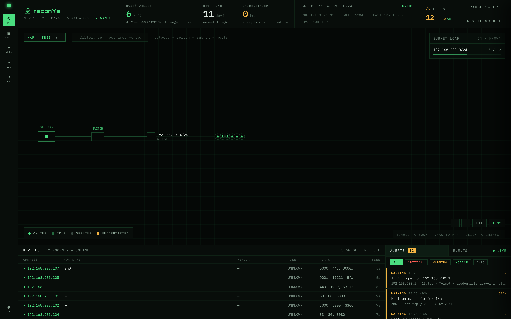

# reconYa

[](https://golang.org/)
[](https://creativecommons.org/licenses/by-nc/4.0/)
[](https://discord.gg/JW7VtBnNXp)
[](https://www.reddit.com/r/reconya/)

**Network reconnaissance and asset discovery tool built with Go.**

Zero external dependencies. No root privileges required.



## Quick Start

```bash
git clone https://github.com/Dyneteq/reconya.git
cd reconya
make install && make start
```

Open `http://localhost:3008` — Login: `admin` / `password`

## Features

- **Network Scanning** — Native Go TCP probing, no nmap required
- **Device Discovery** — MAC addresses, vendors, hostnames, device types
- **Port Scanning** — Top 100 ports with service identification
- **IPv6 Support** — Passive monitoring via NDP
- **Web Dashboard** — Modern HTMX interface with dark theme
- **Real-time Updates** — Live device status and event logging

## Requirements

- Go 1.21+
- make (pre-installed on most systems)

## Commands

```bash
make start      # Start as daemon
make stop       # Stop service
make status     # Check status
make logs       # View logs
make start-dev  # Run in foreground
```

## Configuration

Edit `src/.env`:

```bash
LOGIN_USERNAME=admin
LOGIN_PASSWORD=your_password
JWT_SECRET_KEY=your_secret
SQLITE_PATH=data/reconya.db
```

## How It Works

- Every 30 seconds the agent sweeps the local network and finds live devices.
- Each online device triggers a port scan. If the last port scan is older than 15 minutes, it runs again.
- Every 2 minutes it runs mDNS discovery to resolve hostnames for new devices.
- Every 15 minutes it refreshes the public IP and geolocation.
- Device status updates run every 5 seconds, network detection every 30 seconds, and geolocation cache cleanup every 6 hours.

## Documentation

Full documentation available at **[dyneteq.github.io/reconya](https://dyneteq.github.io/reconya)**

## Contributing

1. Fork the repository
2. Create feature branch (`git checkout -b feature/name`)
3. Commit changes (`git commit -m 'Add feature'`)
4. Push branch (`git push origin feature/name`)
5. Open Pull Request

## License

[CC BY-NC 4.0](https://creativecommons.org/licenses/by-nc/4.0/) — Commercial use requires permission.

## Other Projects

- **[tududi](https://tududi.com)** — Self-hosted task management
- **[BreachHarbor](https://breachharbor.com)** — Cybersecurity suite
- **[Hevetra](https://hevetra.com)** — Child health tracking
