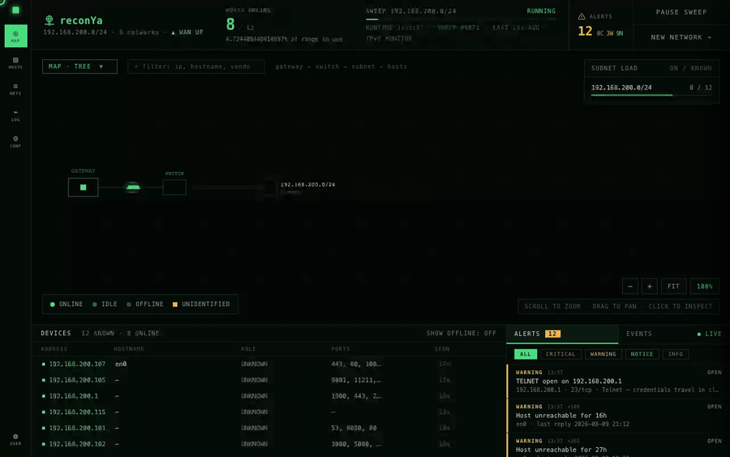

# reconYa

Network reconnaissance and asset discovery tool, built in Go.

reconYa discovers and monitors devices on your local network with real-time updates - for network administrators, security professionals, and home users.



## Features

- **IPv4 network scanning** - device discovery with a native Go implementation (ICMP sweeps, TCP probes, ARP)
- **IPv6 passive monitoring** - detects IPv6 devices through neighbor discovery and interface monitoring, no traffic generated
- **Device identification** - MAC addresses, vendor lookup, hostnames, OS fingerprints, and device type classification
- **Port scanning** - top-ports scans with service detection and banner grabbing, run by background workers
- **Alerting** - new devices, new or risky open ports, unreachable hosts, duplicate MACs, and unidentified hosts raise acknowledgeable alerts
- **Web console** - server-rendered dashboard with topology map, host list, and live event log
- **Multi-network support** - manage several networks with CIDR configuration
- **Zero outbound calls by default** - all external lookups are opt-in (see [Network isolation](#network-isolation))

## Community

Join the community for support, discussions, and updates:

[](https://discord.gg/JW7VtBnNXp)
[](https://www.reddit.com/r/reconya/)

## Installation

### Quick install (pre-built binary)

```bash
curl -sL https://raw.githubusercontent.com/Dyneteq/reconya/master/install.sh | sh
```

This auto-detects your OS and architecture, downloads the correct binary, and sets up the config. Available for Linux (x86_64, ARM64) and macOS (Intel, Apple Silicon).

Then start reconYa:

```bash
cd reconya && sudo ./reconya-*
```

Open `http://localhost:3008` and log in with `admin` / `password` (change this in `.env`).

### Build from source

Requires **Go 1.25+** and **make**.

```bash
git clone https://github.com/Dyneteq/reconya.git
cd reconya
make install     # downloads dependencies, creates a default .env
make start       # start reconYa as a daemon
```

Useful commands:

```bash
make start-dev   # run in the foreground (dev mode)
make stop        # stop reconYa
make status      # check service status
make logs        # view logs
make help        # show all commands
```

### Manual setup

```bash
git clone https://github.com/Dyneteq/reconya.git
cd reconya/backend
cp .env.example .env   # edit to set your credentials
go mod download
go run ./cmd
```

**Windows note:** the SQLite driver needs cgo. If you see a CGO error, run with `CGO_ENABLED=1` and make sure a C compiler (TDM-GCC or Visual Studio Build Tools) is installed.

### Optional build tag: `chromedp`

Links in an in-process Chrome DevTools Protocol driver for web-service screenshots:

```bash
cd backend && go build -tags chromedp ./cmd
```

It is off by default because it adds ~24% of the dependency graph and ~2MB to the binary for a feature that already works without it: with the tag off, screenshots fall back to whichever of `chrome`/`chromium`, `firefox`, `wkhtmltoimage`, or `webkit2png` is installed on the host. Since chromedp also needs a browser on the host, the practical requirement is unchanged.

## Usage

1. Log in with your credentials
2. Set up a network, select it from the dropdown, and start a scan
3. Devices appear automatically as they are discovered
4. Click a device for details: MAC address and vendor, open ports and services, OS fingerprint, and screenshots of web services
5. Use the topology map to visualize the network, watch the event log for activity, and work the alert feed as findings come in

## Configuration

Edit `backend/.env` to customize:

```bash
LOGIN_USERNAME=admin
LOGIN_PASSWORD=your_secure_password
DATABASE_NAME="reconya-dev"
SQLITE_PATH="data/reconya-dev.db"

# IPv6 monitoring
IPV6_MONITORING_ENABLED=true
IPV6_MONITOR_INTERFACES=
IPV6_MONITOR_INTERVAL=30
IPV6_LINK_LOCAL_MONITORING=true
IPV6_MULTICAST_MONITORING=false

# Outbound lookups (see "Network isolation" below) - all default to false
PUBLIC_IP_LOOKUP_ENABLED=false
GEOLOCATION_ENABLED=false
VENDOR_LOOKUP_ONLINE_ENABLED=false
OUI_DOWNLOAD_ENABLED=false
```

## Network isolation

reconYa's backend makes **zero outbound network connections by default**. Scanning, device tracking, and the console all work entirely from data reconYa gathers on the local network itself.

Four features call out to a third party, and every one of them is opt-in (set the corresponding env var to `true` to enable):

| Env var | Calls | Purpose |
|---|---|---|
| `PUBLIC_IP_LOOKUP_ENABLED` | `api.ipify.org` (HTTPS) | Shows your public IP in the HUD |
| `GEOLOCATION_ENABLED` | `ip-api.com` (plain HTTP) | Resolves that public IP to a city/country |
| `VENDOR_LOOKUP_ONLINE_ENABLED` | `api.macvendors.com` (HTTPS) | Looks up a device's manufacturer when its MAC isn't in the built-in OUI table - sent per discovered device |
| `OUI_DOWNLOAD_ENABLED` | `standards-oui.ieee.org` (plain HTTP) | Refreshes the local MAC-vendor table monthly |

With all four left at their default (`false`), the Public IP tile shows a placeholder dash instead of erroring, and vendor lookups are limited to the OUI table already bundled with reconYa.

One remaining browser-side exception: the web UI loads its fonts from Google Fonts (`fonts.googleapis.com`). All other UI assets (CSS, JavaScript) are embedded in the binary and served locally. Vendoring the fonts is tracked as future work for fully offline/air-gapped use.

## Architecture

- **Backend** - Go, serving a server-rendered web console on port 3008
- **Frontend** - Go templates with vanilla JavaScript, all assets embedded in the binary
- **Database** - SQLite for device storage, event logging, and alerts
- **Scanning** - multi-strategy network discovery with a native Go implementation

### Scanning pipeline

1. **Network discovery** (every 30 seconds) - ICMP ping sweeps in privileged mode, TCP connect probes to common ports as a fallback, and ARP table lookups for MAC resolution
2. **Device identification** - IEEE OUI database for vendors, multi-method hostname resolution (DNS, NetBIOS, mDNS), device type classification from ports and vendors
3. **Port scanning** - top 100 ports with service detection and banner grabbing, run concurrently by a worker pool
4. **Web service detection** - automatic discovery of HTTP/HTTPS services with screenshot capture and metadata extraction (titles, server headers)

### IPv6 passive monitoring

IPv6 monitoring activates automatically during network scans and generates no traffic of its own. It watches the Neighbor Discovery (NDP) cache and network interfaces, classifies addresses (link-local `fe80::/10`, unique local `fc00::/7`, global `2000::/3`), and links IPv6 addresses to existing IPv4 devices via their MAC address. Works on Linux, macOS, and Windows.

## Docker (experimental, not recommended)

Docker files live in the `experimental/` directory, but containerized deployment is not recommended: Docker's network architecture prevents containers from reliably accessing Layer 2 (MAC address) information across network segments, even in privileged mode. Use a local installation for full functionality.

## Troubleshooting

**No devices found**
- Run `make status` to check service status
- Check that you're on the same network segment as target devices

**Services won't start**
- Run `make stop` to kill any stuck processes, then `make start`
- Ensure port 3008 is available

**Missing MAC addresses**
- MAC addresses are only visible on the same network segment
- Some devices may not respond to ARP requests

**Crashes or odd behavior**
- Verify your `.env` configuration
- Check logs with `make logs`

**Windows: "go-sqlite3 requires cgo to work"**
- Build or run with `CGO_ENABLED=1` and install a C compiler (TDM-GCC or Visual Studio Build Tools)

## Uninstalling

```bash
make stop      # stop any running processes
make clean     # remove build artifacts
rm -rf reconya # remove the directory
```

## Support the project

If you find reconYa useful, consider supporting its development:

<p align="center">
  <a href="https://github.com/sponsors/chrisvel"></a>
  <a href="https://www.patreon.com/ChrisVeleris"></a>
  <a href="https://coff.ee/chrisveleris"></a>
  <a href="https://www.paypal.com/donate/?hosted_button_id=QEQCKLXPB6XAE"></a>
</p>

Your support helps keep reconYa free, open-source, and actively maintained.

## Contributing

1. Fork the repository
2. Create a feature branch
3. Make changes and test
4. Submit a pull request

## License

Creative Commons Attribution-NonCommercial 4.0 International. Commercial use requires permission.

## Check out my other projects

- **[tududi](https://tududi.com)** - self-hosted task management with hierarchical organization, multi-language support, and Telegram integration
- **[BreachHarbor](https://breachharbor.com)** - cybersecurity suite for digital asset protection
